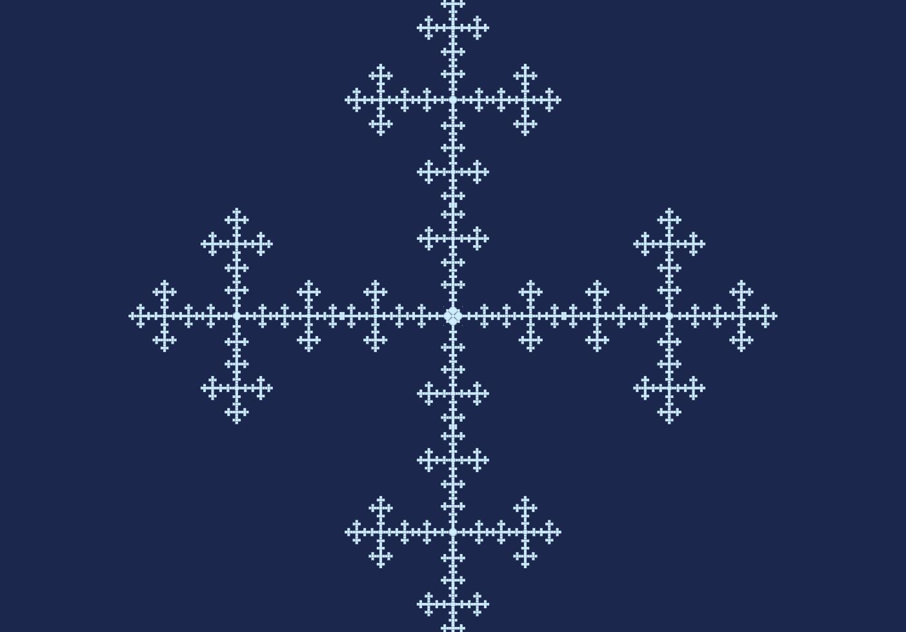

# Vicsek Demo
Test creating a `TwoTrianglesRenderer`
that animates a Kaleidoscopic Iterated Function System (KIFS) 
for the [Vicsek fractal](https://en.wikipedia.org/wiki/Vicsek_fractal)

Also uploaded on Shadertoy: [Vicsek Snowflake](https://www.shadertoy.com/view/ts2fzt)

**TODO** - GIF

